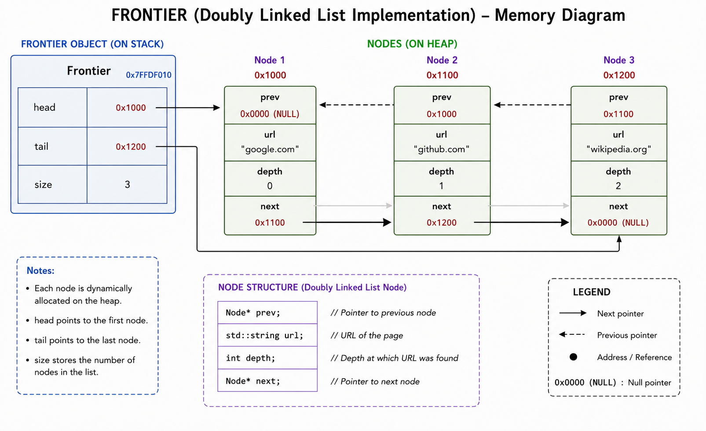
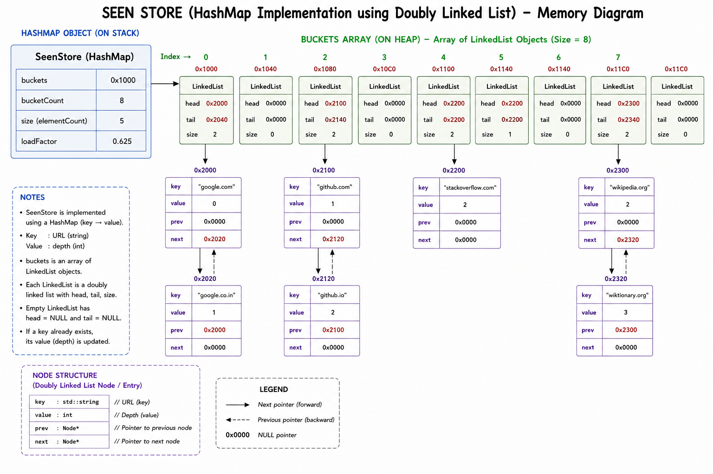

# Design Journal

### Date: 17/07/2026

---

## Section 1 — Specific Bugs

### Bug 1

**Issue:** While designing the Frontier component, it was necessary to accurately represent the memory organization of the implemented data structure.

**Observation:** The implementation uses a doubly linked list where each node maintains references to both the previous and the next node. The memory diagram therefore needed to clearly illustrate bidirectional links along with the `head` and `tail` pointers.

---

### Bug 2

**Issue:** While documenting the SeenStore component, representing the internal bucket organization accurately required careful analysis of the implementation.

**Observation:** The HashMap stores an array of `LinkedList` objects instead of bucket pointers. Every bucket exists as a valid LinkedList object irrespective of whether it currently stores any elements. This organization needed to be reflected correctly in the documentation.

---

### Bug 3

**Issue:** Preparing memory diagrams that closely resemble runtime memory allocation while remaining easy to understand.

**Observation:** Adding representative hexadecimal addresses only for dynamically allocated nodes and important pointers improves readability without unnecessarily increasing the complexity of the diagrams.

---

## Section 2 — Failed Attempts

### Attempt 1

Initially explored different ways of representing the Frontier memory layout.

After comparing multiple layouts, the final representation was chosen to clearly distinguish between stack and heap memory while showing the relationship between the Frontier object and dynamically allocated nodes.

---

### Attempt 2

Considered representing empty buckets as unused memory locations.

After reviewing the overall bucket organization, representing every bucket as a valid LinkedList object was found to be more consistent with the implementation and easier to understand.

---

### Attempt 3

Initially experimented with displaying memory addresses for every object and data member.

Although this produced a more detailed diagram, it also reduced readability. The final design includes addresses only for dynamically allocated nodes and the important pointer fields, providing a better balance between realism and clarity.

---

## Section 3 — Design Decisions

Today's work focused on finalizing the design documentation for the crawler components.

The following design decisions were documented:

- Representing Frontier using a Doubly Linked List.
- Using `head` and `tail` pointers to support efficient insertion and removal operations.
- Representing SeenStore using a HashMap with Separate Chaining.
- Storing an array of LinkedList objects as buckets.
- Using doubly linked lists for collision resolution.
- Including representative hexadecimal memory addresses for dynamically allocated nodes.
- Standardizing the representation of null pointers using `0x0000`.
- Refining the internal representation and memory diagrams to closely match the implementation.

These decisions improve both the accuracy of the documentation and its overall readability.

---

## Section 4 — Code Reference

### Files Modified

- `DOCS/design proposal/frontier_design_proposal.md`
- `DOCS/design proposal/seenstore_design_proposal.md`
- `DOCS/design proposal/frontier_memory_diagram.png`
- `DOCS/design proposal/seenstore_memory_diagram.png`

### Major Sections Updated

- Frontier Public API
- SeenStore Public API
- Internal Representation
- Memory Diagrams
- Design Decisions
- Future Compatibility
- Documentation

---

## Memory Diagrams

## Section 5 — Learning Reflection

Today's work strengthened my understanding of documenting data structures from an implementation perspective rather than only describing their conceptual behavior.

While preparing the design proposal, I analyzed how objects are organized in memory and how different components interact during execution. This helped me understand the importance of accurately representing stack allocation, heap allocation, pointer relationships, and ownership within memory diagrams.

Working on the HashMap documentation also improved my understanding of bucket organization, separate chaining, and how linked lists are used internally to manage collisions. At the same time, preparing the Frontier documentation reinforced the working of doubly linked lists and the role of `head`, `tail`, `prev`, and `next` pointers.

Overall, today's work emphasized that good software documentation should closely reflect the actual implementation while remaining simple enough for future developers to understand and maintain.