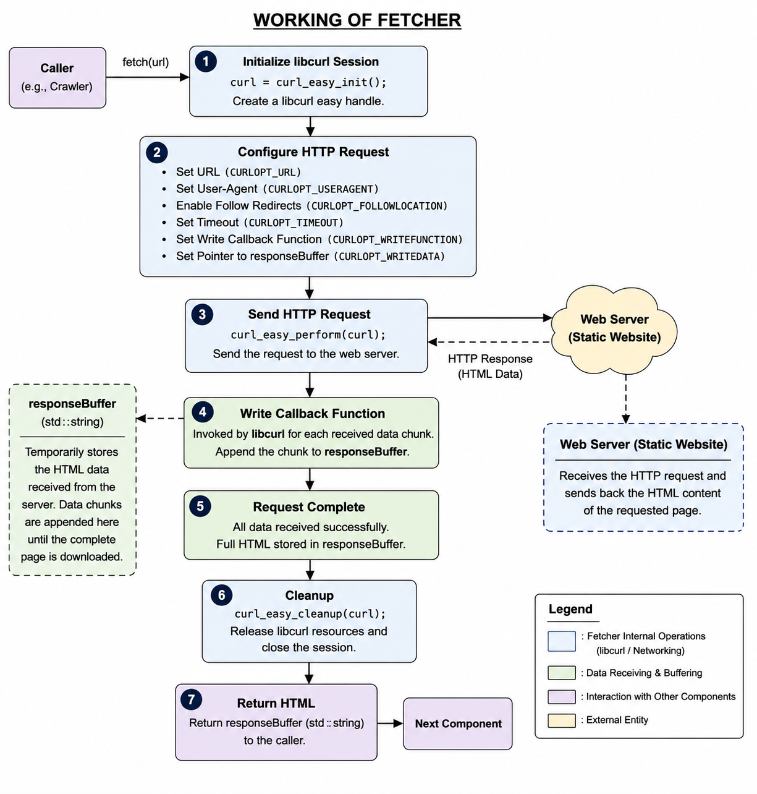

# Fetcher
The **Fetcher** is responsible for retrieving the HTML content of a webpage from a given URL using the HTTP protocol. It serves as the communication layer between the crawler and the web by sending HTTP requests and downloading webpage content. The component does not parse, analyze, or store the retrieved data; instead, it simply returns the raw HTML so that other crawler components can process it further.

---
## Section 1 — Public API

### Method 1

```cpp
std::string fetch(const std::string& url);
```

**Purpose**

Downloads the webpage located at the specified URL and returns its HTML content.

**Parameters**

- `url` — The URL of the webpage to be downloaded.

**Returns**

- A `std::string` containing the complete HTML of the webpage if the request is successful.
- An empty string if the request fails or the webpage cannot be retrieved.

---

## Section 2 — Internal Representation



The Fetcher is designed as a lightweight networking component whose primary responsibility is to download the HTML content of a webpage. Unlike other crawler components such as Frontier or Page Storage, the Fetcher does not permanently maintain any webpage information. Instead, it temporarily stores only the resources required while processing an HTTP request.

### Private Data Members

#### 1. CURL* curl

```cpp
CURL* curl;
```

The `curl` pointer stores the libcurl session handle used to configure and execute an HTTP request. It acts as the communication interface between the Fetcher and the remote web server.

During a request, the handle is configured with parameters such as:

- Target URL
- User-Agent string
- Redirect policy
- Timeout duration
- Callback function used to receive downloaded data

The handle exists only while a request is being processed and is released immediately after the request completes.

---

#### 2. std::string responseBuffer

```cpp
std::string responseBuffer;
```

The `responseBuffer` temporarily stores the HTML content received from the web server.

Whenever libcurl receives a block of data, it invokes the callback function. The callback appends the received bytes to `responseBuffer` until the complete webpage has been downloaded.

After the download finishes successfully, the contents of `responseBuffer` are returned to the caller as the webpage's HTML.

---

### Data Flow

The Fetcher performs the following sequence of operations internally:

1. Initialize a libcurl session.
2. Configure the HTTP request using the supplied URL.
3. Send the request to the remote web server.
4. Receive the webpage content in small chunks.
5. Append each chunk to `responseBuffer` through the callback function.
6. After the download completes, return the accumulated HTML.
7. Release the libcurl session and all associated resources.

Since the Fetcher does not cache webpages or maintain any persistent state, its memory usage depends only on the size of the webpage currently being downloaded.

## Section 3 — Failure Handling

The Fetcher is designed to handle network failures gracefully without causing the crawler to terminate unexpectedly. Before performing an HTTP request, it verifies that the libcurl session has been successfully initialized. If the session cannot be created, the Fetcher immediately returns an empty string.

During the request, if `curl_easy_perform()` reports an error due to reasons such as an invalid URL, connection timeout, DNS resolution failure, or server unavailability, the request is considered unsuccessful. In such cases, the Fetcher releases all allocated libcurl resources using `curl_easy_cleanup()` and returns an empty string to the caller.

After the request completes, the HTTP response code is checked. If the server responds with a status code other than **200 (OK)**, the Fetcher treats the request as a failure and returns an empty string.

Returning an empty string allows higher-level crawler components to detect the failure and decide how to proceed, such as skipping the URL, logging the error, or retrying the request, while keeping the Fetcher independent of crawler-specific policies.

## Section 4 - Complexity Estimates

### fetch(const std::string& url)

**Time Complexity:** **O(n)**

where **n** is the size of the HTML page (in bytes or characters).

**Explanation:**

- Initializing the libcurl session and configuring the HTTP request require constant time, **O(1)**.
- As the webpage is downloaded, each received data chunk is appended to `responseBuffer`.
- Every byte of the HTML document is processed exactly once by the callback function.
- Therefore, the total running time grows linearly with the size of the downloaded webpage.

**Space Complexity:** **O(n)**

where **n** is the size of the downloaded HTML document stored in `responseBuffer`.

## Section 5 — Future Compatibility

The Fetcher has been designed as an independent networking component responsible solely for downloading the HTML content of a webpage. By separating webpage retrieval from parsing and storage, the component can be reused by future crawler modules without modifying its public interface.

The HTML returned by the Fetcher can be passed directly to the **Page Storage** component for persistent storage. The stored pages can then be consumed by the **Indexer**, which will extract hyperlinks, tokenize text, and build search indexes. Since the Fetcher is unaware of how the downloaded content is processed, improvements to parsing or indexing will not require any changes to the Fetcher.
