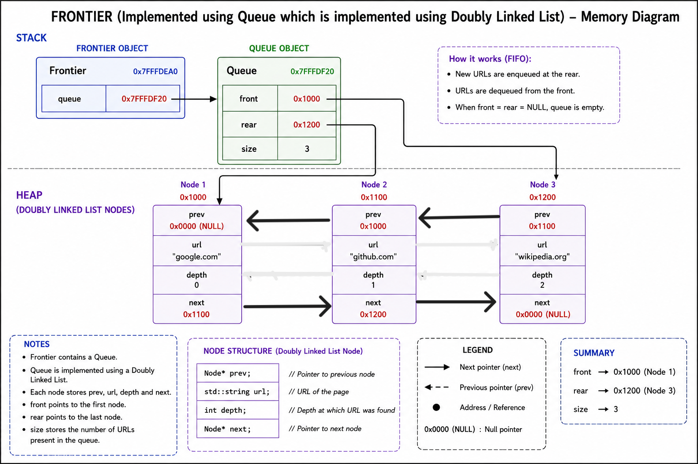

# Frontier
The Frontier is a data structure that maintains the list of URLs waiting to be crawled. It acts as the crawler's work queue by storing every discovered URL along with its crawl depth. As the crawler processes web pages, new URLs are inserted into the Frontier, and the next URL is removed for processing until the Frontier becomes empty. 

The Frontier is responsible for managing URLs that have been discovered but have not yet been crawled. Each entry stores both the URL and its corresponding crawl depth so that the crawler can enforce the maximum crawl depth.

## Section 1: Public API

```cpp
struct URLDepth {
    std::string url;
    int depth;
};

class Frontier {
public:
    void push(const URLDepth& item);
    URLDepth pop();
    URLDepth front() const;
    bool empty() const;
    int size() const;
};
```

### API Justification

**Method 1** : ```push(const URLDepth& item)```, it will take a `URLDepth` object as input, which contains both the URL and its corresponding depth, and insert it into the Frontier. This method is used whenever the crawler discovers a new valid webpage that has not been visited before. Since the only purpose of this function is to insert a new entry into the Frontier and no additional information needs to be returned to the caller, the return type is `void`.

**Method 2** : ```pop()```, it will remove the next `URLDepth` object from the Frontier and return it to the crawler. The returned object contains both the URL that needs to be crawled next and its depth. Since the crawler requires both pieces of information to continue the traversal, the return type is `URLDepth`.

**Method 3** : ```front() const```, it will return the next `URLDepth` object present in the Frontier without removing it. This method is useful whenever the crawler wants to inspect the next URL before actually processing it. Since the Frontier should remain unchanged after this operation, the function is declared `const`, and the return type is `URLDepth`.

**Method 4** : ```empty() const```, it will not take any parameter and simply check whether the Frontier currently contains any URLs. If there are no entries left, it returns `true`; otherwise, it returns `false`. Therefore, the return type is `bool`.

**Method 5** : ```size() const```, it will not take any parameter and will return the current number of `URLDepth` objects stored inside the Frontier. This can be useful for monitoring the crawler's progress or for debugging purposes. Hence, the return type is `int`.

---

## Section 2 : Internal Representation




The **Frontier** class is implemented as a **Queue** using a **Doubly Linked List** that we have implemented in our DS Library project. This implementation allows elements to be inserted at the rear (enqueue) and removed from the front (dequeue) in **O(1)** time while preserving the order in which URLs are discovered during web crawling.

The class maintains the following private data members:

- **head** – A pointer to the first node in the queue. This node represents the next `URLDepth` object to be removed.
- **tail** – A pointer to the last node in the queue. New elements are always inserted after this node.
- **count** – An integer storing the current number of elements present in the queue.

Each node of the doubly linked list contains:

- A pointer to a dynamically allocated `URLDepth` object.
- A pointer to the next node in the queue.
- A pointer to the previous node in the queue.

Each `URLDepth` object stores:

- A `std::string` representing the URL.
- An integer representing the crawl depth.

The `Frontier` class owns both the doubly linked list nodes and the associated `URLDepth` objects. Memory for new nodes and their corresponding `URLDepth` objects is allocated dynamically during insertion and is released when nodes are removed or when the `Frontier` object is destroyed. Since each node is allocated independently, the queue can grow dynamically without requiring reallocation or copying of existing elements.

The accompanying memory layout diagram illustrates the relationship between the `Frontier` object, the doubly linked list nodes, and the dynamically allocated `URLDepth` objects stored in heap memory. The `head` pointer always references the front of the queue, while the `tail` pointer references the rear, ensuring constant-time enqueue and dequeue operations.

## Section 3 : Failure Handling 

The `Frontier` class is responsible for maintaining the queue of URLs to be crawled. Memory management for the underlying data structures is handled by the custom Data Structures Library. The `Frontier` class therefore focuses on handling failures related to queue management and URL insertion.

The following failure cases are handled:

- **Invalid URLs:** URLs that do not conform to the expected format are rejected and are not inserted into the frontier.

- **Duplicate URLs:** Before inserting a URL, the crawler checks whether it has already been discovered or is already present in the frontier. Duplicate URLs are ignored to prevent redundant crawling.

- **Maximum Crawl Depth:** If a discovered URL exceeds the user-specified maximum crawl depth, it is discarded and is not added to the frontier.

- **Empty Frontier:** If a dequeue operation is requested when the frontier is empty, the operation safely indicates that no URLs remain to be processed, allowing the crawler to terminate gracefully without accessing invalid data.

These checks ensure that the frontier always contains only valid URLs that are eligible for crawling while maintaining the correctness of the queue throughout execution.

## Section 4 : Complexity  Estimates

### 1. `push(const URLDepth& item)`

- **Best Case:** The push operation takes **O(1)** time because a new node is inserted directly at the rear of the queue using the `tail` pointer.<br>

- **Average Case:** The push operation takes **O(1)** time since insertion always requires updating only a constant number of pointers.<br>

- **Worst Case:** The push operation takes **O(1)** time because no traversal of the linked list is required regardless of the number of elements in the queue.<br>

---

### 2. `pop()`

- **Best Case:** The pop operation takes **O(1)** time when the queue contains one or more elements, as the front node is removed directly using the `head` pointer.<br>

- **Average Case:** The pop operation takes **O(1)** time because removing the first node only involves updating the `head` pointer and adjusting the adjacent links.<br>

- **Worst Case:** The pop operation takes **O(1)** time regardless of the size of the queue since no traversal is performed.<br>

---

### 3. `front() const`

- **Best Case:** **O(1)**  
  The function directly returns the `URLDepth` object stored at the front of the queue.

- **Average Case:** **O(1)**  
  The front element is accessed directly through the stored `head` pointer without traversing the linked list.

- **Worst Case:** **O(1)**  
  Even for a very large queue, the operation performs only a single pointer dereference.

**Reason:**  
The queue maintains a direct pointer to the first node (`head`), allowing the front element to be accessed in constant time.

---

### 4. `empty() const`

- **Best Case:** **O(1)**  
  The function checks whether the queue contains any elements by examining the stored element count.

- **Average Case:** **O(1)**  
  The operation always performs a single comparison regardless of the number of elements in the queue.

- **Worst Case:** **O(1)**  
  The execution time remains constant even for very large queues.

**Reason:**  
The queue maintains the current number of elements in the `count` member variable, allowing emptiness to be determined with a single comparison.

---

### 5. `size() const`

- **Best Case:** **O(1)**  
  The function directly returns the stored `count` member variable without traversing the linked list.

- **Average Case:** **O(1)**  
  Regardless of the number of elements in the queue, the stored count is returned directly.

- **Worst Case:** **O(1)**  
  Even for a very large queue, the operation only accesses a single member variable.

**Reason:**  
The current number of elements is maintained in the `count` member variable, so retrieving the queue size requires only a single memory access.


## Section 5 — Future Compatibility

The Frontier class is designed to operate independently of the crawler's networking and storage components. It exposes a simple queue interface (`push`, `pop`, `front`, `empty`, and `size`) that can be reused by future projects requiring breadth-first traversal of URLs or other work items.

Since the Frontier stores `URLDepth` objects, additional metadata can be added to the `URLDepth` class in future projects without requiring changes to the queue implementation. This separation of responsibilities ensures that future components, such as the crawler or scheduler, can use the Frontier without modifying its internal implementation.