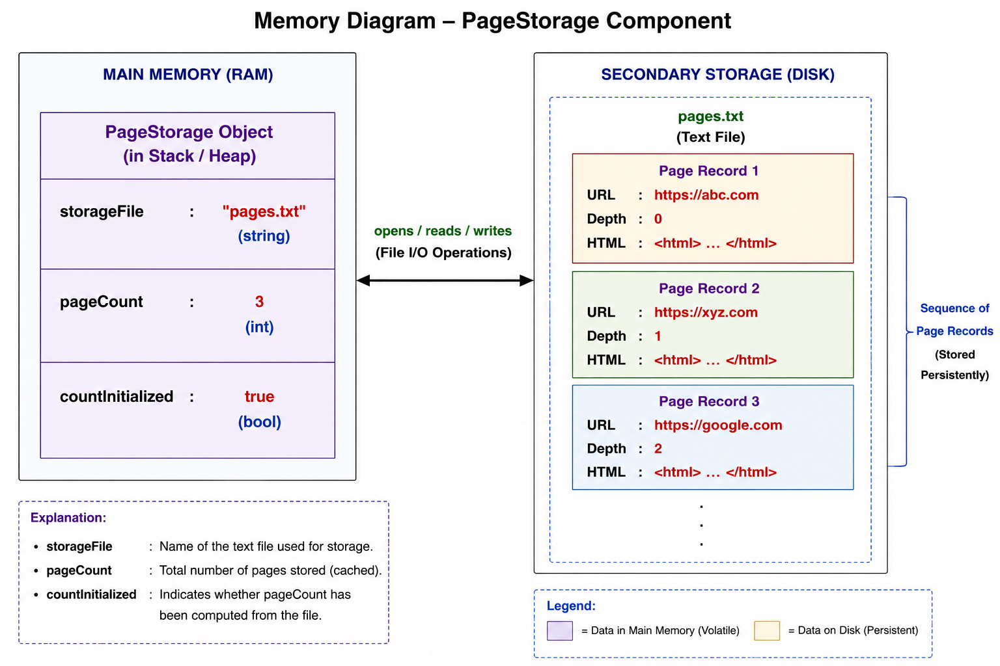

# Page Store 
The **Page Store** is a storage component responsible for maintaining all webpages downloaded by the web crawler. Each stored page consists of its URL, the HTML content retrieved from that URL, and the crawl depth at which the page was discovered. The Page Store acts as a centralized repository that allows crawled pages to be efficiently stored, retrieved, and managed without requiring the crawler to download them again. This separation of storage from crawling enables other components, such as the Indexer in Project 03, to access and process the stored pages independently.

## Section 1 : Public API

**Method 1:** `storePage(string url, string html, int depth)`

This method stores a crawled webpage in the Page Storage. It takes the URL of the webpage, its HTML content, and the crawl depth as input and writes this information into the storage file. If a page with the same URL already exists, its stored information is updated. Since the purpose of this function is only to store the page and no value needs to be returned to the caller, the return type is `void`.

---

**Method 2:** `getPage(string url)`

This method takes a URL as input and retrieves the HTML content associated with that URL from the storage. Since the stored webpage content is returned to the caller, the return type is `string`.

---

**Method 3:** `hasPage(string url)`

This method checks whether a webpage corresponding to the given URL already exists in the Page Storage. It returns `true` if the page is present; otherwise, it returns `false`. Hence, the return type is `bool`.

---

**Method 4:** `pageCount()`

This method does not take any parameters and returns the total number of webpages currently stored in the Page Storage. Since the number of stored pages is represented as an integer, the return type is `int`.

# Section 2 — Internal Representation

The `PageStorage` component is implemented using a text file to persistently store every webpage downloaded by the crawler. Unlike the Frontier and Seen Store, which maintain data structures in memory, the Page Storage writes webpage information directly to secondary storage so that the data remains available even after the program terminates.

Each stored page consists of three pieces of information:

- **URL** – The unique address of the webpage.
- **HTML Content** – The complete HTML source code downloaded from the webpage.
- **Depth** – The crawl depth at which the webpage was discovered.

These three fields are stored together as a single page record in the text file. Each record represents one crawled webpage.

Whenever `storePage()` is called, the component writes a new page record to the storage file or updates the existing record if the URL is already present.

The `getPage()` function searches the storage file for the requested URL and returns the corresponding HTML content.

The `hasPage()` function sequentially scans the stored records to determine whether the specified URL already exists.

The `pageCount()` function counts the total number of page records currently stored in the file and returns that value.

Since the data is stored on disk rather than in memory, the Page Storage provides persistent storage, allowing the Indexer in Project 03 to access previously crawled webpages without requiring another crawl.

## Section 3 — Failure Handling

The following failure cases are considered during the design of the `PageStorage` component:

### 1. Storage File Cannot Be Opened

Before reading from or writing to the storage file, the component verifies that the file has been successfully opened. If the file cannot be opened due to an invalid path or insufficient permissions, the requested operation is aborted and an appropriate error message is reported.

---

### 2. Empty URL

Since the URL uniquely identifies every webpage, the component checks whether the supplied URL is empty before performing any operation. If an empty URL is provided, the request is rejected.

---

### 3. Page Not Found

When `getPage()` or `hasPage()` searches for a URL that does not exist in the storage file, `getPage()` returns an empty string while `hasPage()` returns `false`. This prevents invalid accesses to nonexistent records.

---

### 4. File Write Failure

If a write operation fails due to a file system error or insufficient disk space, the page is not stored and the operation terminates without modifying the existing storage.

## Section 4 : Complexity Estimates

### 1. `storePage(string url, string html, int depth)`

- **Best Case:** **O(1)**  
  If the page is appended directly to the storage file without requiring a search for an existing record, the write operation takes constant time.

- **Average Case:** **O(n)**  
  On average, the component scans approximately half of the stored page records to determine whether the URL already exists before storing or updating the page.

- **Worst Case:** **O(n)**  
  If the URL is located near the end of the file or does not exist, every stored page record must be examined before the new page is written.

**Reason:**  
The page records are stored sequentially in a text file, so locating an existing URL requires a linear scan through the stored records.

---

### 2. `getPage(string url)`

- **Best Case:** **O(1)**  
  The requested webpage is found in the first page record of the storage file.

- **Average Case:** **O(n)**  
  On average, approximately half of the stored page records are examined before the requested URL is found.

- **Worst Case:** **O(n)**  
  If the webpage is stored near the end of the file or does not exist, the entire storage file must be scanned.

**Reason:**  
The storage file is searched sequentially because no indexing mechanism is maintained.

---

### 3. `hasPage(string url)`

- **Best Case:** **O(1)**  
  The requested URL is found in the first page record.

- **Average Case:** **O(n)**  
  Approximately half of the stored page records are examined before determining whether the URL exists.

- **Worst Case:** **O(n)**  
  If the URL is absent or stored in the final page record, the entire storage file must be scanned.

**Reason:**  
The component performs a sequential search through the storage file until a matching URL is found or the end of the file is reached.

---

### 4. `pageCount()`

- **Best Case:** **O(1)**  
  If the total number of pages has already been initialized, the function directly returns the stored page count.

- **Average Case:** **O(1)**  
  After the initial scan, the stored page count is returned directly without accessing the storage file.

- **Worst Case:** **O(n)** *(only during the first invocation)*  
  During the first call, the component scans the storage file once to count the total number of stored page records. The computed count is then cached and updated whenever a new page is stored.

**Reason:**  
The Page Storage uses **lazy initialization** for the page count. The storage file is scanned only once during the first invocation of `pageCount()`, after which the count is maintained in memory and updated whenever a new page is added. Therefore, all subsequent calls execute in constant time.

# Section 5 — Future Compatibility

The `PageStorage` component is designed to serve as the persistent data source for the **Indexer** in Project 03. Instead of downloading webpages again, the Indexer will retrieve the previously stored pages directly from the Page Storage, reducing unnecessary network requests and improving overall efficiency.

Each stored page contains the webpage's URL, HTML content, and crawl depth. The Indexer can use the `getPage()` method to retrieve the HTML content of a specific webpage for parsing and token extraction, while `hasPage()` can be used to verify the existence of a page before attempting retrieval. The `pageCount()` method provides the total number of stored pages, enabling the Indexer to monitor processing progress.

Since the Page Storage stores webpage data persistently in a text file, all crawled pages remain available even after the crawler terminates. This separation of responsibilities allows the crawler to focus solely on downloading webpages while the Indexer independently processes the stored content to build the search index. Such a modular design improves maintainability, promotes code reuse, and allows both components to evolve independently.
